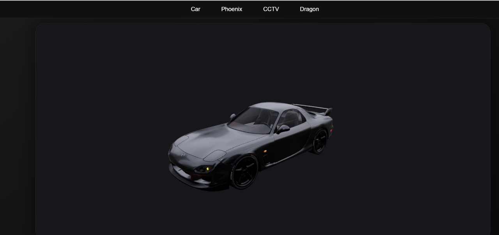
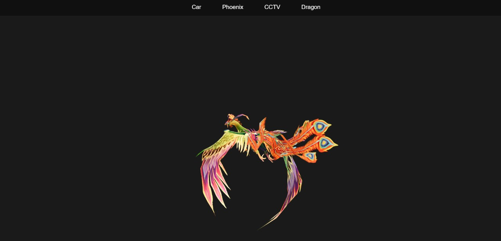
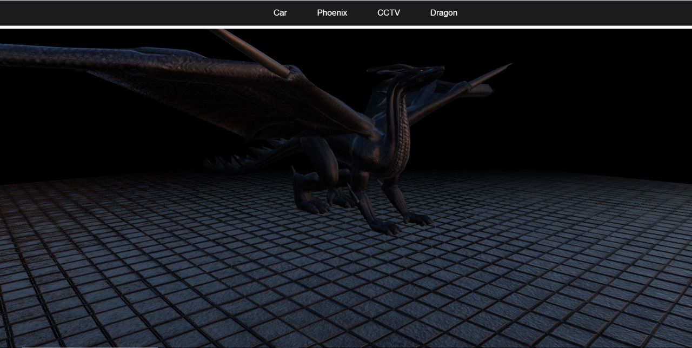

# My Vite App

This project is a 3D web application built using React, Three.js, and Vite. It features various 3D models and scenes, including a car, phoenix, CCTV, and dragon.

## Features
- Interactive 3D models
- Realistic environments
- Smooth animations
- Responsive design

## Setup Instructions

1. Clone the repository:
    ```bash
    git clone https://github.com/yourusername/my-vite-app.git
    cd my-vite-app
    ```

2. Install dependencies:
    ```bash
    npm install
    ```

3. Start the development server:
    ```bash
    npm run dev
    ```

4. Build the project:
    ```bash
    npm run build
    ```

## Usage

- Navigate to different scenes using the navigation bar.
- Interact with 3D models using mouse controls.

## Screenshots

### Car Scene


### Phoenix Scene


### Dragon Scene


## Technologies Used
- React
- Three.js
- Vite
- @react-three/fiber
- @react-three/drei

## License
This project is licensed under the MIT License.

## Acknowledgements
- [React Three Fiber](https://github.com/pmndrs/react-three-fiber)
- [Three.js](https://threejs.org/)